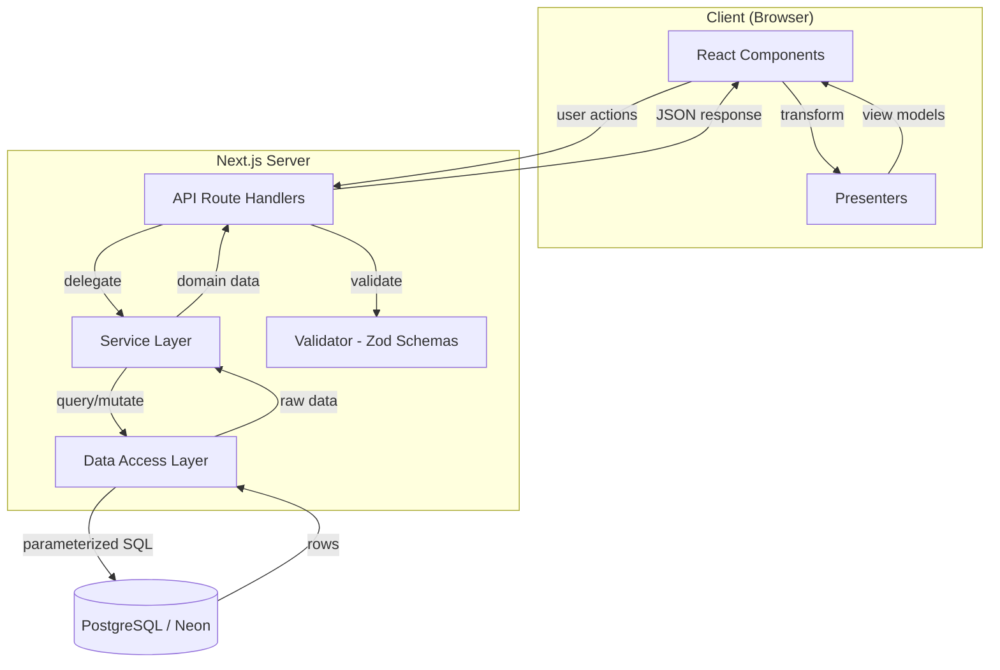
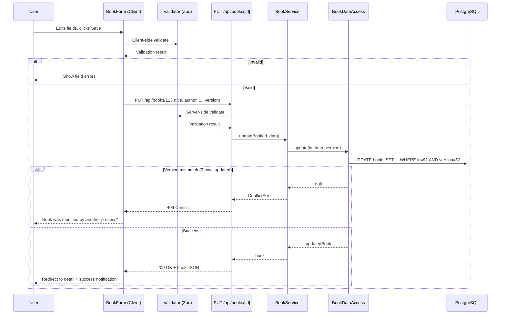

# Design Document: Book Management CRUD

## Overview

This design describes a full-stack Book Management CRUD application built with Next.js (App Router) and React. The application connects to an existing PostgreSQL (Neon) database and provides a web interface for managing book records — creating, listing, viewing, updating, deleting, and marking books as sold.

The architecture follows clean architecture principles with a clear layered separation: React components (View), Presenters (transformation layer), API route handlers, service logic, and a data access layer. Optimistic locking via a `version` field prevents lost updates during concurrent edits. Input validation is shared between client and server using a common schema defined with Zod.

### Key Design Decisions

1. **Next.js App Router** — Uses the `/app` directory with Server Components for data fetching and Client Components for interactive forms. API routes live under `/app/api/`.
2. **Zod for shared validation** — A single Zod schema validates input on both client and server, satisfying the shared validation requirement without duplication.
3. **Raw SQL with parameterized queries** — Uses the `pg` library directly (no ORM) to maintain full control over queries and ensure parameterized queries for SQL injection prevention. This keeps the stack minimal for an MVP.
4. **Presenter pattern** — A dedicated presenter module transforms database rows into view models, decoupling the DB schema from the UI contract.
5. **Optimistic locking** — Update and buy operations include `version` in the WHERE clause and increment it on success. A version mismatch returns 409 Conflict.

## Architecture



### Layer Responsibilities

| Layer | Location | Responsibility |
|---|---|---|
| **View** | `src/components/` | React components (pages, forms, lists). Server Components for read, Client Components for interactivity. |
| **Presenter** | `src/presenters/` | Transforms API response data into view models (e.g., formatting dates, deriving display flags like `canBuy`). |
| **API Route Handlers** | `src/app/api/books/` | HTTP layer — parses requests, calls validator, delegates to service, returns HTTP responses with correct status codes. |
| **Service** | `src/services/` | Business logic — orchestrates validation, calls data access, applies business rules (e.g., sold books can't be edited on price/status). |
| **Data Access** | `src/data/` | SQL queries via `pg` with parameterized statements. Single responsibility: talk to the database. |
| **Validator** | `src/validators/` | Zod schemas shared between client and server for input validation. |

### Request Flow (Example: Update a Book)



## Components and Interfaces

### API Route Handlers

```
src/app/api/books/route.ts          — GET (list), POST (create)
src/app/api/books/[id]/route.ts     — GET (detail), PUT (update), DELETE (delete)
src/app/api/books/[id]/buy/route.ts — PATCH (buy)
```

#### Endpoint Specifications

| Method | Path | Request Body | Success Response | Error Responses |
|---|---|---|---|---|
| GET | `/api/books` | — | 200 + `Book[]` | 500 (DB error) |
| POST | `/api/books` | `CreateBookInput` | 201 + `Book` | 400 (validation), 500 (DB error) |
| GET | `/api/books/[id]` | — | 200 + `Book` | 404 (not found), 500 (DB error) |
| PUT | `/api/books/[id]` | `UpdateBookInput` | 200 + `Book` | 400 (validation), 404 (not found), 409 (conflict), 500 (DB error) |
| DELETE | `/api/books/[id]` | — | 204 | 404 (not found), 500 (DB error) |
| PATCH | `/api/books/[id]/buy` | `{ version: number }` | 200 + `Book` | 404 (not found), 409 (conflict), 500 (DB error) |

### Service Layer Interface

```typescript
// src/services/bookService.ts

interface BookService {
  getAllBooks(): Promise<Book[]>;
  getBookById(id: string): Promise<Book | null>;
  createBook(input: CreateBookInput): Promise<Book>;
  updateBook(id: string, input: UpdateBookInput): Promise<Book>;
  deleteBook(id: string): Promise<void>;
  buyBook(id: string, version: number): Promise<Book>;
}
```

### Data Access Layer Interface

```typescript
// src/data/bookRepository.ts

interface BookRepository {
  findAll(): Promise<BookRow[]>;
  findById(id: string): Promise<BookRow | null>;
  insert(data: InsertBookData): Promise<BookRow>;
  update(id: string, data: UpdateBookData, version: number): Promise<BookRow | null>;
  deleteById(id: string): Promise<boolean>;
  updateStatus(id: string, status: string, version: number): Promise<BookRow | null>;
}
```

### Validator Schemas

```typescript
// src/validators/bookSchemas.ts

const createBookSchema = z.object({
  title: z.string().trim().min(1).max(100),
  author: z.string().trim().min(1).max(100),
  isbn: z.string().trim().max(255).optional().or(z.literal("")),
  price: z.number().min(0),
});

const updateBookSchema = z.object({
  title: z.string().trim().min(1).max(100),
  author: z.string().trim().min(1).max(255),
  isbn: z.string().trim().max(255).optional().or(z.literal("")),
  price: z.number().min(0),
  version: z.number().int().min(0),
});

const buyBookSchema = z.object({
  version: z.number().int().min(0),
});
```

### Presenter Interface

```typescript
// src/presenters/bookPresenter.ts

interface BookViewModel {
  id: string;
  title: string;
  author: string;
  isbn: string;
  status: "AVAILABLE" | "SOLD";
  price: string;          // formatted as currency string, e.g. "$12.99"
  canBuy: boolean;        // true when status === "AVAILABLE"
  canEdit: boolean;       // true when status === "AVAILABLE" (for price/status fields)
  createdAt: string;      // formatted date string
  updatedAt: string | null;
  version: number;
}

function toBookViewModel(book: Book): BookViewModel;
function toBookListViewModel(books: Book[]): BookViewModel[];
```

### React Components

| Component | Type | Location | Purpose |
|---|---|---|---|
| `BooksPage` | Server Component | `src/app/books/page.tsx` | Fetches and displays book list |
| `BookDetailPage` | Server Component | `src/app/books/[id]/page.tsx` | Fetches and displays single book |
| `CreateBookPage` | Client Component | `src/app/books/new/page.tsx` | Renders BookForm for creation |
| `EditBookPage` | Client Component | `src/app/books/[id]/edit/page.tsx` | Renders BookForm for editing |
| `BookForm` | Client Component | `src/components/BookForm.tsx` | Reusable form with Zod validation |
| `BookList` | Client Component | `src/components/BookList.tsx` | Renders book table/cards with Buy buttons |
| `ConfirmDialog` | Client Component | `src/components/ConfirmDialog.tsx` | Reusable confirmation modal |
| `EmptyState` | Component | `src/components/EmptyState.tsx` | Displayed when no books exist |
| `ErrorMessage` | Component | `src/components/ErrorMessage.tsx` | Displays error messages |
| `Notification` | Client Component | `src/components/Notification.tsx` | Toast-style success/error notifications |

### Error Response Structure

All API error responses follow a consistent format:

```typescript
interface ApiErrorResponse {
  status: number;
  message: string;
  errors?: FieldError[];  // present for validation errors
}

interface FieldError {
  field: string;
  message: string;
}
```

## Data Models

### Database Schema (Existing)

The `books` table already exists in the PostgreSQL (Neon) database:

```sql
CREATE TABLE books (
  id        BIGINT GENERATED ALWAYS AS IDENTITY PRIMARY KEY,
  title     VARCHAR(100) NOT NULL,
  author    VARCHAR(255) NOT NULL,
  isbn      VARCHAR(255),
  status    VARCHAR(20) DEFAULT 'AVAILABLE',
  price     FLOAT8 CHECK (price >= 0),
  created_at TIMESTAMP NOT NULL DEFAULT NOW(),
  updated_at TIMESTAMP,
  version   BIGINT DEFAULT 0
);
```

### TypeScript Types

```typescript
// src/types/book.ts

// Direct mapping from database row
interface BookRow {
  id: string;           // bigint comes as string from pg
  title: string;
  author: string;
  isbn: string | null;
  status: "AVAILABLE" | "SOLD";
  price: number;
  created_at: Date;
  updated_at: Date | null;
  version: number;
}

// Domain model used in service layer
interface Book {
  id: string;
  title: string;
  author: string;
  isbn: string | null;
  status: "AVAILABLE" | "SOLD";
  price: number;
  createdAt: Date;
  updatedAt: Date | null;
  version: number;
}

// Input for creating a book
interface CreateBookInput {
  title: string;
  author: string;
  isbn?: string;
  price: number;
}

// Input for updating a book
interface UpdateBookInput {
  title: string;
  author: string;
  isbn?: string;
  price: number;
  version: number;
}
```

### Data Transformation Flow

```
BookRow (DB) → Book (Domain) → BookViewModel (UI)
```

- **BookRow → Book**: Converts snake_case fields to camelCase (done in data access layer)
- **Book → BookViewModel**: Formats dates, prices, derives `canBuy`/`canEdit` flags (done in presenter)

## Correctness Properties

*A property is a characteristic or behavior that should hold true across all valid executions of a system — essentially, a formal statement about what the system should do. Properties serve as the bridge between human-readable specifications and machine-verifiable correctness guarantees.*

### Property 1: Presenter produces all required fields

*For any* valid `Book` object, transforming it through `toBookViewModel` SHALL produce a `BookViewModel` containing non-undefined values for all required display fields: `id`, `title`, `author`, `isbn`, `status`, `price`, `createdAt`, and `version`.

**Validates: Requirements 1.2, 3.1**

### Property 2: Presenter status flags are correctly derived

*For any* valid `Book` object, the `toBookViewModel` function SHALL set `canBuy` to `true` and `canEdit` to `true` when `status` is `AVAILABLE`, and SHALL set `canBuy` to `false` and `canEdit` to `false` when `status` is `SOLD`.

**Validates: Requirements 4.7, 6.1, 6.5**

### Property 3: Validation schema accepts valid inputs and rejects invalid inputs

*For any* input object, the book validation schema SHALL accept the input if and only if: `title` is a non-empty string of at most 100 characters, `author` is a non-empty string of at most 255 characters, `isbn` is either absent or a string of at most 255 characters, and `price` is a non-negative number. The same schema SHALL apply to both create and update operations.

**Validates: Requirements 2.2, 2.5, 4.4**

### Property 4: Created book has correct defaults

*For any* valid `CreateBookInput`, calling `createBook` SHALL produce a `Book` with `status` equal to `AVAILABLE`, a non-null `createdAt` timestamp, and a `version` of `0`.

**Validates: Requirements 2.1**

### Property 5: Update increments version and sets updated_at

*For any* valid `UpdateBookInput` applied to an existing `Book` with a matching version, calling `updateBook` SHALL produce a `Book` whose `version` is exactly one greater than the original and whose `updatedAt` is non-null.

**Validates: Requirements 4.1**

### Property 6: Buy transitions status to SOLD

*For any* `Book` with status `AVAILABLE` and a matching version, calling `buyBook` SHALL produce a `Book` with `status` equal to `SOLD` and a non-null `updatedAt` timestamp.

**Validates: Requirements 6.2**

### Property 7: Optimistic locking rejects stale versions

*For any* `Book` and any version number that does not match the book's current version, both `updateBook` and `buyBook` SHALL reject the operation with a version conflict error.

**Validates: Requirements 4.2, 4.3, 6.3, 6.4**

### Property 8: Input sanitization trims whitespace and strips unknown fields

*For any* input object containing string fields with leading or trailing whitespace, the validation schema SHALL produce trimmed output. *For any* input object containing fields not defined in the book schema, the validation schema SHALL strip those fields from the output.

**Validates: Requirements 7.3, 7.5**

### Property 9: Error responses have consistent structure

*For any* API error response, the response body SHALL contain a `status` field (number) and a `message` field (string). When the error is a validation error, the response body SHALL additionally contain an `errors` array of objects each with `field` and `message` string fields.

**Validates: Requirements 7.6**

## Error Handling

### Error Categories and HTTP Responses

| Error Type | HTTP Status | Trigger | Response |
|---|---|---|---|
| Validation Error | 400 | Invalid input (missing fields, constraint violations) | `{ status: 400, message: "Validation failed", errors: [{ field, message }] }` |
| Not Found | 404 | Book ID doesn't exist in database | `{ status: 404, message: "Book not found" }` |
| Version Conflict | 409 | Optimistic locking mismatch | `{ status: 409, message: "Book was modified by another process. Please refresh and try again." }` |
| Server Error | 500 | Database connection failure, unexpected errors | `{ status: 500, message: "An internal error occurred" }` |

### Error Handling Strategy

1. **API Route Handlers** — Wrap all handler logic in try/catch. Catch known error types (ValidationError, NotFoundError, ConflictError) and map to appropriate HTTP responses. Catch unknown errors and return 500 with a generic message. Log all 500 errors server-side.

2. **Service Layer** — Throws typed errors:
   - `ValidationError` — when Zod parsing fails
   - `NotFoundError` — when a query returns no rows for a given ID
   - `ConflictError` — when an optimistic locking update affects 0 rows

3. **Data Access Layer** — Catches `pg` errors and either re-throws as domain errors or lets them propagate as unexpected errors for the handler to catch as 500s.

4. **Client Side** — React components handle API error responses by:
   - Displaying field-level errors from 400 responses on the form
   - Showing a notification for 409 conflicts with a prompt to refresh
   - Showing a generic error notification for 500 errors
   - Showing "Book not found" with a back link for 404 responses

### Custom Error Classes

```typescript
// src/errors/index.ts

class AppError extends Error {
  constructor(public status: number, message: string) {
    super(message);
  }
}

class ValidationError extends AppError {
  constructor(public errors: FieldError[]) {
    super(400, "Validation failed");
  }
}

class NotFoundError extends AppError {
  constructor(resource: string = "Resource") {
    super(404, `${resource} not found`);
  }
}

class ConflictError extends AppError {
  constructor(message: string = "Resource was modified by another process") {
    super(409, message);
  }
}
```

## Testing Strategy

### Testing Framework

- **Unit & Integration Tests**: Vitest (fast, native ESM support, compatible with Next.js)
- **Property-Based Tests**: fast-check (with Vitest as the test runner)
- **Component Tests**: React Testing Library (with Vitest)

### Test Structure

```
src/
├── __tests__/
│   ├── unit/
│   │   ├── validators/
│   │   │   └── bookSchemas.test.ts       # Validation schema tests (unit + PBT)
│   │   ├── presenters/
│   │   │   └── bookPresenter.test.ts     # Presenter transformation tests (unit + PBT)
│   │   ├── services/
│   │   │   └── bookService.test.ts       # Service logic tests (unit + PBT)
│   │   └── errors/
│   │       └── errorHandler.test.ts      # Error response structure tests
│   ├── integration/
│   │   └── api/
│   │       ├── books.test.ts             # API route handler integration tests
│   │       └── books-buy.test.ts         # Buy endpoint integration tests
│   └── components/
│       ├── BookForm.test.tsx             # Form rendering and validation UI
│       ├── BookList.test.tsx             # List rendering, empty state, buy button
│       └── ConfirmDialog.test.tsx        # Confirmation dialog behavior
```

### Property-Based Testing Approach

Each correctness property from the design document maps to a property-based test using `fast-check`. Tests are configured with a minimum of 100 iterations.

| Property | Test File | What It Generates |
|---|---|---|
| Property 1: Presenter field completeness | `bookPresenter.test.ts` | Random `Book` objects with varied field values |
| Property 2: Presenter status flags | `bookPresenter.test.ts` | Random `Book` objects with AVAILABLE/SOLD status |
| Property 3: Validation accept/reject | `bookSchemas.test.ts` | Random strings, numbers, objects for valid/invalid inputs |
| Property 4: Created book defaults | `bookService.test.ts` | Random valid `CreateBookInput` objects |
| Property 5: Update version/timestamp | `bookService.test.ts` | Random valid `UpdateBookInput` + existing books |
| Property 6: Buy status transition | `bookService.test.ts` | Random available books with matching versions |
| Property 7: Optimistic locking | `bookService.test.ts` | Random books with mismatched version numbers |
| Property 8: Input sanitization | `bookSchemas.test.ts` | Random strings with whitespace + objects with extra fields |
| Property 9: Error response structure | `errorHandler.test.ts` | Random error types and messages |

Each property test is tagged with a comment:
```typescript
// Feature: book-management-crud, Property 1: Presenter produces all required fields
```

**Configuration**: Each property test runs a minimum of 100 iterations:
```typescript
fc.assert(fc.property(...), { numRuns: 100 });
```

### Unit Testing Coverage

Unit tests complement property tests by covering specific examples and edge cases:

- **Validation**: Specific examples of valid/invalid inputs, boundary values (exactly 100 chars for title, price of 0, negative price)
- **Presenter**: Specific formatting checks (date format, currency format), null isbn handling
- **Service**: Specific business rule checks (sold book price/status edit prevention)
- **Error handling**: Specific error scenarios (DB connection failure, constraint violation)

### Integration Testing Coverage

Integration tests verify the full request/response cycle through API route handlers:

- **CRUD operations**: Create, read, update, delete flows with real (test) database
- **Status codes**: Verify correct HTTP status codes for success and error scenarios
- **Optimistic locking**: End-to-end conflict detection
- **Buy flow**: End-to-end purchase with status transition

### Component Testing Coverage

Component tests verify React component behavior:

- **BookForm**: Renders correctly, shows validation errors, disables fields for sold books
- **BookList**: Renders book data, shows empty state, shows/hides buy button based on status
- **ConfirmDialog**: Opens on delete/buy click, calls handler on confirm, cancels on dismiss

